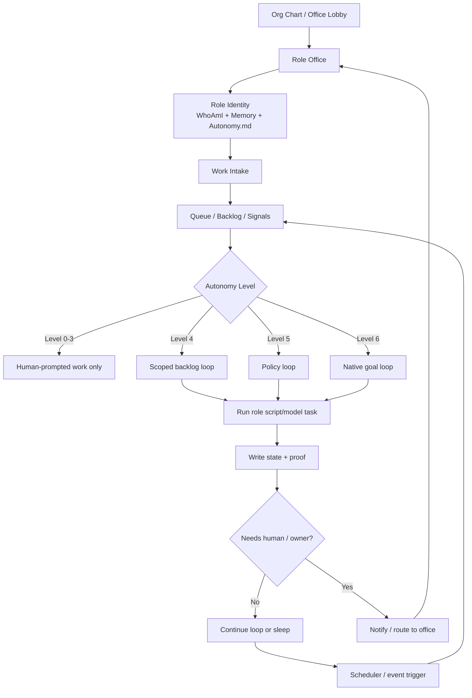

# Role Office Runtime Flow

Owner: Tess / Autonomy Engineer

Status: draft architecture note

Created: 2026-06-24

## Purpose

This note preserves the operating-flow diagram for Mindshare role offices.

The core idea is that the org chart becomes the entrance to the office. Each role can still feel present and conversational, but live AI sessions should be temporary runtime resources rather than the permanent identity of the role.

Codex remains the workshop and repair/control room. The operating environment should live in durable files, queues, scripts, workers, proofs, dashboards, and role-office UI.

## Core Architecture

- Org chart as lobby.
- Office as interface.
- Role files as identity.
- Queues and signals as work source.
- Scripts/workers as runtime.
- Model adapters as cognition.
- State/proof as memory of action.
- Codex as builder and repair shop.

## Runtime Flow

## Level Semantics

Level 4 means there is approved work on the role's backlog and the role can process it through a scoped loop.

Level 5 means there is an approved policy class of work the role can evaluate repeatedly.

Level 6 means there is a role-native goal the role can pursue continuously within approved boundaries.

## Live Session Rule

The company can be operating without every chat window being open.

A live model session should open when there is active conversation, active work, an exception, or a visible report. When the work is complete and the office is idle, the live session should close while role identity, history, state, and proof remain durable.

## Design Implication

The Mindshare app should support role offices as durable interfaces, not long-running Codex sessions. A role office should load the role's identity and current state on demand, route chat through the correct model adapter, and let background scripts/workers handle routine checks silently until human-visible work exists.
